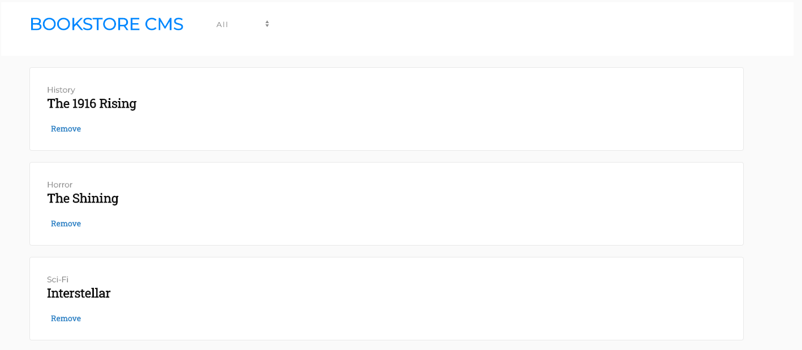

# Redux Bookstore CMS
This is a CMS for a bookstore where users can add books, remove books, and search by category.



## Tools Used:
- React
- Redux
- Javascript
-	HTML
- CSS

### Live Demo
To view the app on Heroku, [click here](https://redux-bookstore-veskova.herokuapp.com/).

### How to Use
* Visit the live link or clone the project in the terminal by running
```
git clone
```
* Install dependencies
```
npm install
```
* Start the server
```
npm start
```
* Browse the page, add and remove books, search for books by category.

### 👤 Authors
## Eva Veskova Jackson
- Github: [@evaveskova](https://github.com/evaveskova)
- Linkedin: [Eva Veskova Jackson](https://www.linkedin.com/in/evaveskova/)

## Vladimir Luna
- Github: [@noomdalv](https://github.com/noomdalv/)
- Linkedin: [Vladimir Luna](https://www.linkedin.com/in/vladlunasan/)

### 🤝 Contributing
Contributions, issues and feature requests are welcome!

### Show your support
Give a ⭐️ if you like this project!

### 📝 License
This project is [MIT](lic.url) licensed.